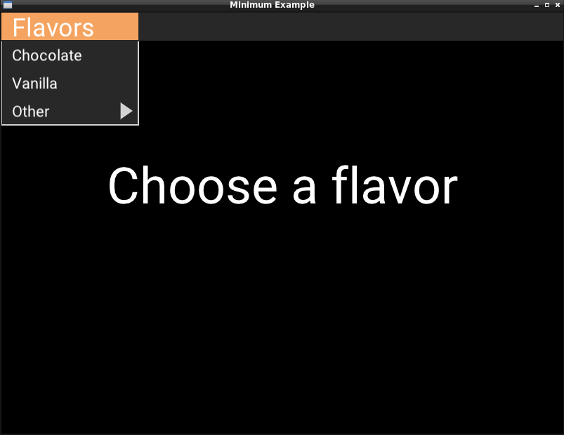

A menu bar example based on #16

Requires using: https://github.com/scenic-contrib/scenic-widget-contrib

# Scenic Examples

This repo contains a collection of demonstration projects for the [Scenic](https://github.com/boydm/scenic) framework for Elixir.

## Example projects

**Fundamentals**:
* `minimum_example` is a completely stripped-down project that displays a single window with some text and no input.
* `pubsub` shows how to use `Scenic.PubSub`.
* `multiple_viewports` shoes how to create an app with multiple viewports.

**Transforms**:
* `transform_translate` shows how translation transforms work.

**Drawing**:
* `primitives` shows the drawing primitives available for use with Scenic.
* `text` shows how to use different features of text support.
* `sprites` shows how to use the asset pipeline to render sprites.

**Input**:

* `input_keyboard` shows how to handle keyboard input.
* `input_mouse` shows how to handle click input.
* `input_mouse_stateful` shows how to implement stateful mouse input (i.e., dragging, other interactions).
* `input_viewport` shows how to handle viewport input events.

**[Scenic Widget Contrib](https://github.com/scenic-contrib/scenic-widget-contrib)**:

* [`contrib_menu_bar`](./contrib_menu_bar) demos the MenuBar component
  * 

## TODO Projects

**Drawing**:

* `fill_basic` shows how to use basic and gradient fills.
* `fill_streaming` shows how to use a streaming fill.
* `fill_image` shows how to use an image fill from the asset pipeline.
* `stroke_basic` shows how to use basic and gradient strokes.
* `stroke_streaming` shows how to use a streaming stroke.
* `stroke_image` shows how to use an image stroke from the asset pipeline.

**Components**:

* `component_slider` shows how to use a slider component.
* `component_radio` shows how to use a radio component.
* `component_text` shows how to use a text component.
* `component_password` shows how to use a password component.
* `component_dropdown` shows how to use a dropdown component.
* `component_button` shows how to use a button component.
* `component_checkbox` shows how to use a checkbox component.
* `component_toggle` shows how to use a toggle component.

**Transforms**:

* `transform_rotation` shows how rotation transforms work.
* `transform_pin` shows how pins work.
* `transform_scale` shows how scale transforms work.

## Contributing

The applications in each example all share the same names (`Example` and `:example) so creating a new example is very easy:

    cp -r minimum_example new_example_name`
